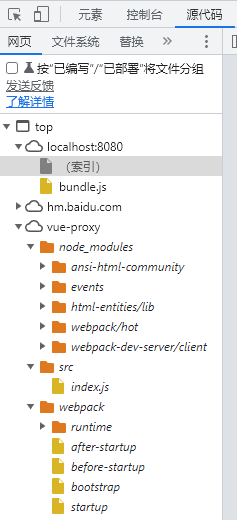

[手写『从数据响应到数据绑定』【前端轮子】](https://www.bilibili.com/video/BV18D4y1X7am?p=2&vd_source=e16c1be73a593977e174e1eb2406d207)

# webpack搭建项目

1、下载源代码

[vue3 GitHub 源代码](https://github.com/vuejs/core)

```
git clone https://github.com/vuejs/core.git
```


2、初始化

```
npm install -y
```

生成package.json文件


*3、安装reactivity

```
npm i @vue/reactivity
```

生成node_modules/@vue


4、安装打包工具

```
yarn add webpack webpack-cli webpack-dev-server html-webpack-plugin
```

生成yarn.lock文件

- 打包HTML资源：html-webpack-plugin
- 打包图片资源：html-loader、url-loader、file-loader


5、[webpack.config.js配置](https://webpack.docschina.org/configuration/)

```webpack.config.js
const HtmlWebpackPlugin = require("html-webpack-plugin"),
    { resolve } = require('path');

module.exports = {
    entry: './src/index.js',
    output: {
        path: resolve(__dirname, 'dist'),
        filename: 'bundle.js'
    },
    devtool: 'source-map',
    plugins: [
        new HtmlWebpackPlugin({
            template: resolve(__dirname, 'src/index.html')
        })
    ],
    mode: 'development'
}
```

- devtool: 'source-map',

在开发时使用，浏览器中可以看到清晰的代码结构




问题：

https://blog.csdn.net/cc18868876837/article/details/113915176

1、Uncaught SyntaxError: Cannot use import statement outside a module

script标签默认`type="text/javascript"`，需要改为`type="module"`


2、Access to script at XXX from origin 'null' has been blocked by CORS policy: Cross origin requests are only supported for protocol schemes: http, data, chrome, chrome-extension, chrome-untrusted, https, isolated-app.

安装插件 live Server


3、Failed to load module script: Expected a JavaScript module script but the server responded with a MIME type of "text/html". Strict MIME type checking is enforced for module scripts per HTML spec.


