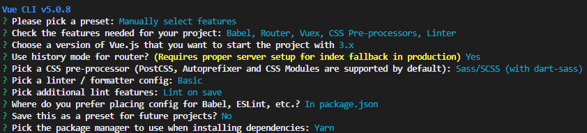

# 1、项目搭建

## 创建项目

```VUE
npm install -g @vue/cli
```

```VUE
vue create constellation-pro
```



```vue
vue add vue-next
```


## 配置跨域

```vue.config.js
const { defineConfig } = require('@vue/cli-service')
module.exports = defineConfig({
  transpileDependencies: true,
  // 跨域
  devServer: {
    proxy: {
      '/api': {
        // 目标源
        // target: 'http://web.juhe.cn:8080/',
        target: 'http://localhost:5555/',
        // 换源
        changeOrigin: true,
        // websocket
        ws: true,
        // 不检查https
        secure: false,
        // 目录重写
        pathRewrite: {
          '^/api': ''
        }
      }
    },
  },
  // 设置是否在开发环境下每次保存代码时都启用eslint验证
  lintOnSave: false,
})
```


## 结构分析与划分

assets 资源

- css
- img
- js

components 组件

- common
- header
- tab

config 配置

- keys.js

data 存放页面公共静态数据

- nav.js
- tab.js
- error.js

libs 工具类

- https.js
- utils.js

router 路由

- index.js

servies 请求

- index.js
- request.js

store 全局变量

- index.js

views 页面


# 2、数据请求与接口请求的封装

## 安装

```
yarn add -S axios qs
```


# 3、vuex数据存储


# 4、路由切换

> 实现效果：点击底部菜单栏，跳转不同的页面，点击时样式发生改变

在底部tab组件内，使用router-link

```
<router-link :to="path" class="tab-icon">
    <i class="icon">{{iconText}}</i>
    <p><slot></slot></p>
</router-link>
```

router-link被点击时会新增.router-link-active的class，用于编写点击时的样式

```CSS
.router-link-active {
    i {
        background-color:$activeColor;
    }
    p {
        color:$activeColor
    }
}
```

